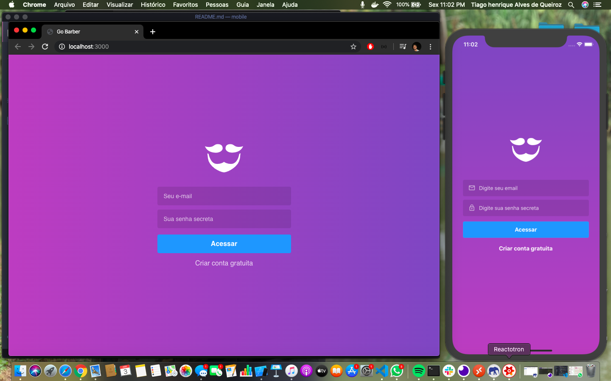

<h3 align="center">
  GoBarber Mobile
</h3>

<h1 align="center">
  
</h1>

This project was build during bootcamp gostack of Rocketseat! You can search git repositories and issues. 

<blockquote align="center">“Não espere para plantar, apenas tenha paciência para colher”!(Rocketseat, 2020)</blockquote>

### **How to use**

- 1: Run<strong> yarn</strong> ( install all dependencies);
- 2: Run<strong> cd ios / pod install</strong> ( install all pods);
- 3: Run<strong>Open the folder created and run react-native run-ios or run-android</strong> ( Run server );

Qualquer dúvida só me comunicar =] (tiagohenriquequeiroz@gmail.com)
